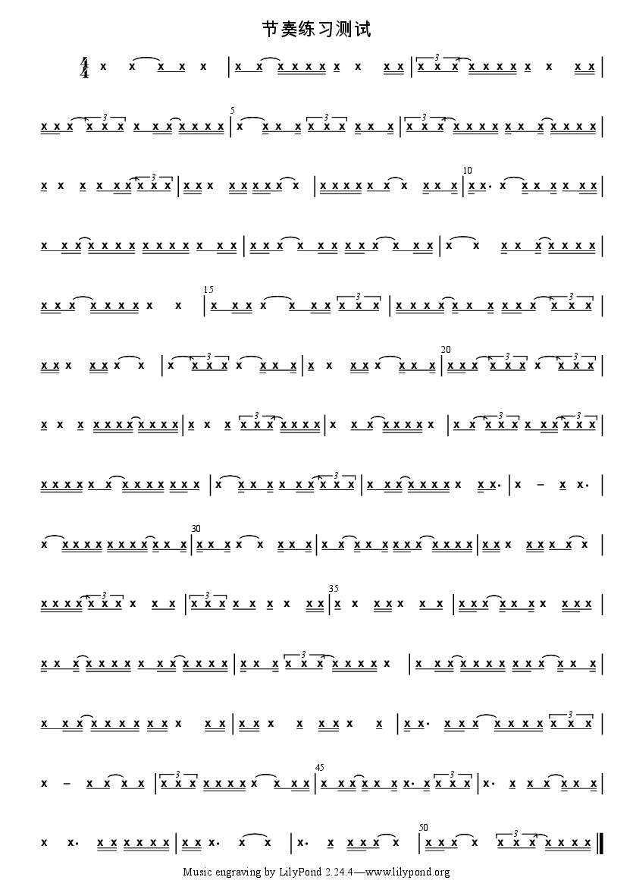

# 节奏练习生成器

我在学习音乐的过程中，发现自己对节奏节拍的掌握比较薄弱，本项目可以自动生成各类节奏型混合的简谱，有助于锻炼节奏能力。网上主流的制谱软件对简谱编写支持较少（像 [MuseScore](https://musescore.org/en) 只支持五线谱），[番茄简谱](http://zhipu.lezhi99.com/Zhipu-index.html)等国内的软件并不是开源的，无法编写自动化脚本。经过搜寻，我发现了[LilyPond](https://lilypond.org/)这款开源的制谱软件。配合[jianpu-ly.py](https://github.com/ssb22/jianpu-ly)这个项目，可以比较方便地编写简谱。LilyPond 的脚本需要编译生成 pdf 或者图片文件，并不是所见即所得，所以不太适合作曲，但非常适合通过程序随机生成节奏型混合。

## 安装必备软件

你需要使用 Python 来运行这个程序，我使用的是 Python 3.10 的 Conda 虚拟环境，当前的脚本比较简洁，jianpu-ly 的部分也以单 Python 文件的形式放在里本项目仓库中，你可以使用系统自带的 Python 运行，但当需要使用 pip 安装任何额外的包时，我推荐使用一个 Conda 的虚拟环境，你可以通过下面的命令创建并激活一个虚拟环境。

```bash
conda create --name lilypond Python=3.10
conda activate lilypond
```

软件还依赖于 LilyPond，所以你需要自行安装 LilyPond，获得可执行文件，并确保你的环境变量 PATH 包含了可执行文件所在的路径。你可以阅读[LilyPond 的下载页说明](https://lilypond.org/download.html)，根据自己电脑的系统安装这个软件。

## 开始使用

你可以通过下面的命令来生成一个简谱 pdf 文件。

```bash
python app.py -m hardmixed -n 200 -s 4/4 -t "节奏练习测试" -o "./rhythm_practice.pdf"
```

你会得到一个如下的文件（当然结果不同，因为节奏型是随机的）。



你可以通过`python app.py --help`获得帮助文档，由于软件使用比较简单，我就不再赘述，请参考下面的帮助输出。

```bash
usage: app.py [-h] [-m {onebeat,twobeat,mixed,hardmixed}] [-n NUM_OF_BEATS]
              [-s TIME_SIGNATURE] [-t TITLE] [-o OUTPUT]

本软件可以随机生成一系列由各种节奏型组成的简谱，旨在帮助同学在音乐学习过程中熟练掌握节奏型。

options:
  -h, --help            show this help message and exit
  -m {onebeat,twobeat,mixed,hardmixed}, --mode {onebeat,twobeat,mixed,hardmixed}
                        onebeat 将生成各种一拍节奏
                        twobeat 将生成各种两拍节奏型
                        mixed 将生成各种混合节奏型
                        hardmixed 将生成含有前面所有的节奏型以及带连线的节奏型
  -n NUM_OF_BEATS, --num_of_beats NUM_OF_BEATS
                        输入总共需要生成多少,默认生成8拍
  -s TIME_SIGNATURE, --time_signature TIME_SIGNATURE
                        输入拍号(默认为4/4拍)
  -t TITLE, --title TITLE
                        输入生成的简谱的标题
  -o OUTPUT, --output OUTPUT
                        选择生成的文件名
```
